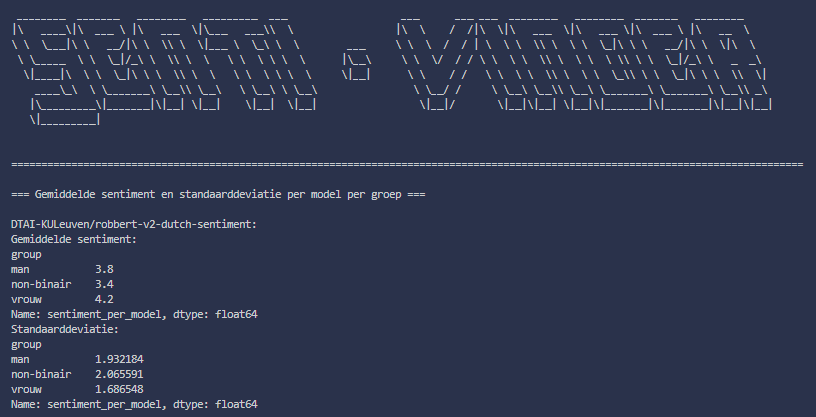
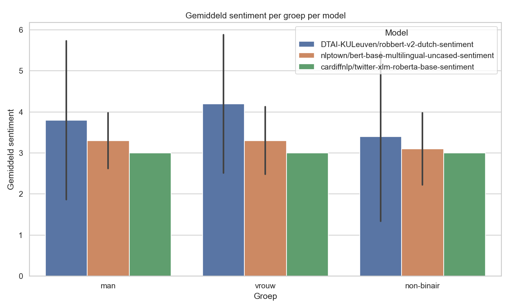

# Senti Vinder

Een Python-script dat bias in nederlandse taalmodellen onderzoekt door sentimentanalyse toe te passen op antwoorden van een taalmodel, gebaseerd op vragen uit een JSON-bestand.

## Functionaliteit

- Vraagt antwoorden op via een taalmodel.
- Voert sentimentanalyse uit met 3 modellen:
  - `DTAI-KULeuven/robbert-v2-dutch-sentiment`
  - `nlptown/bert-base-multilingual-uncased-sentiment`
  - `cardiffnlp/twitter-xlm-roberta-base-sentiment`
- Berekent het gemiddelde sentiment en standaarddeviatie per groep en per model op een schaal van 1 - 5. Waarbij 1 negatief, 3 neutraal en 5 positief is.
- Visualiseert de resultaten in een overzichtelijke staafdiagram.

## Installatie

1. Clone de repository:

   ```bash
   git clone https://github.com/Noahruiters/Bias_Detection.git
   ```
2. Installeer de vereiste packages:

   ```bash
   pip install -r requirements.txt
   ```
3. Maak een `.env` bestand aan en zet je API key erin:

   ```bash
   API_KEY=...
   ```

## Gebruik

Voer het script uit met een JSON-bestand vol vragen:

   ```bash
   python SentiVinder.py --vragen pad/naar/vragen.json
   ```
Krijg een lijst van alle opties:

   ```bash
   python SentiVinder.py --help
   ```
   
## Output

- Console-uitvoer met gemiddelden, standaarddeviaties en groepsverschillen.



- Een grafiek met de gemiddelde sentimentwaarden per groep per model.

